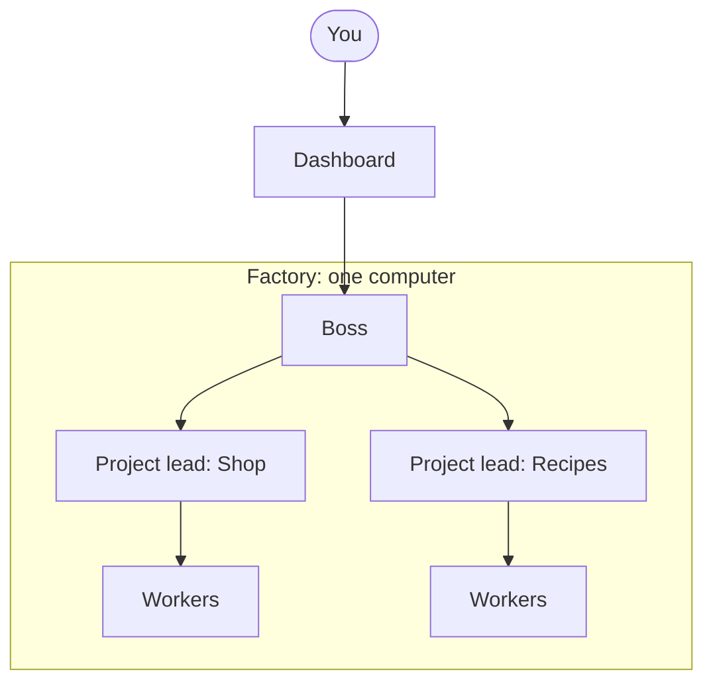
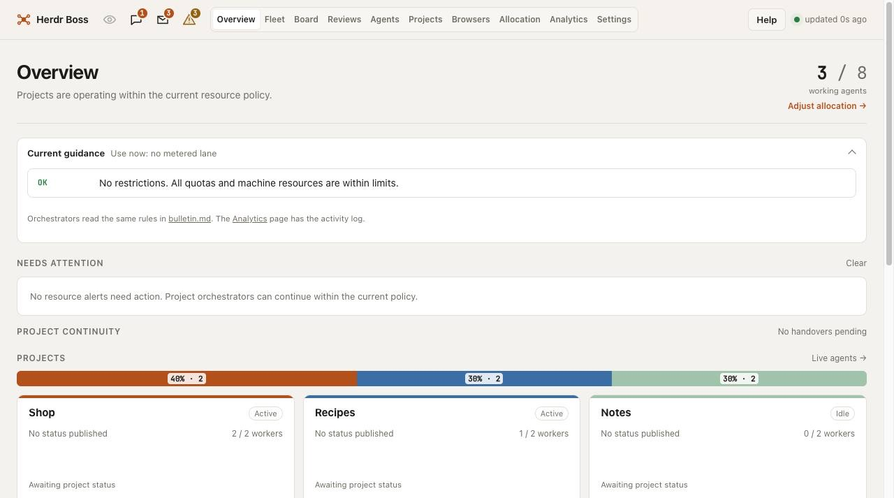
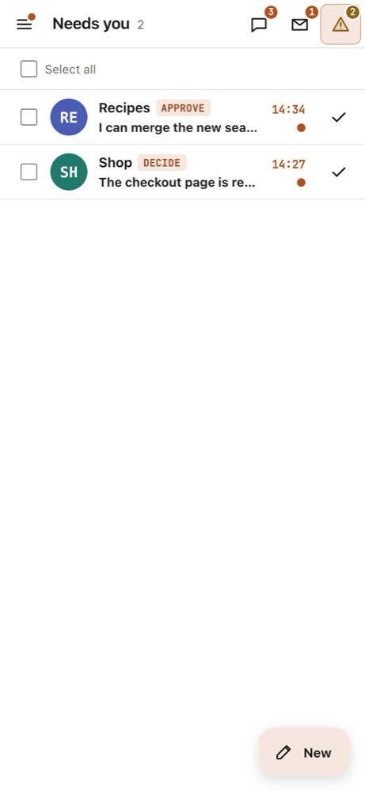
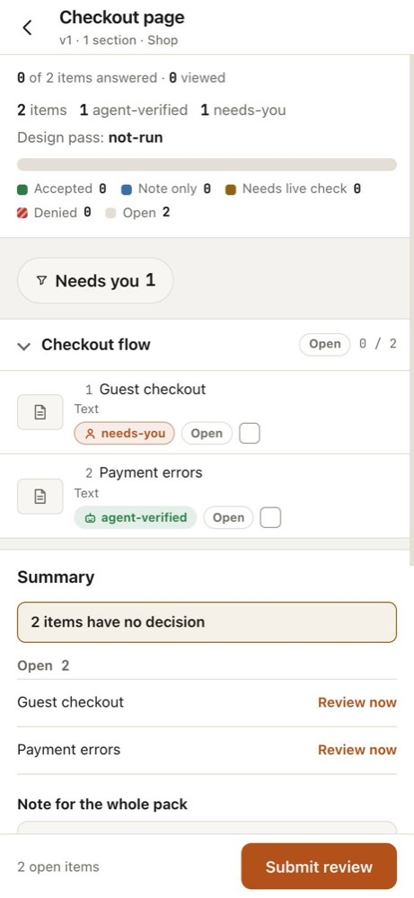

# Herdr Boss

Herdr Boss helps you build products with coding agents. It runs one agent for each project and watches all of them. It asks you a question only when an agent cannot go on without you.

You see all projects on one dashboard, also on your phone. Herdr Boss runs on your computer. It works with [Herdr](https://herdr.dev), the terminal program that holds your agents.

## What you get

- One agent for each project that leads the work, and workers that do the tasks.
- A dashboard that shows what every agent does, also on your phone.
- Questions only when an agent needs you, in the Mailbox.
- Review packs: you judge the finished work one item at a time.
- Control of your usage limits, so that no agent uses up your plan.
- Support for more than one computer. Each computer is a factory.

## How the parts fit

You talk to the Boss through the dashboard. The Boss watches all projects. Each project has one project lead. The project lead gives tasks to workers. A factory is one complete Herdr Boss setup on one computer.

## Start here

[Start here](docs/start-here.md) is a checklist for your first hour. It ends with your first project on the dashboard.

## What it looks like

The Overview shows all projects and the usage limits.

<picture>
  <source media="(prefers-color-scheme: dark)" srcset="docs/images/readme/overview-dark.jpg">
  
</picture>

The Mailbox lists the questions that need you. This is the phone view.

<picture>
  <source media="(prefers-color-scheme: dark)" srcset="docs/images/readme/mailbox-dark.jpg">
  
</picture>

A review pack lists the items that you judge. This is the phone view.

<picture>
  <source media="(prefers-color-scheme: dark)" srcset="docs/images/readme/review-dark.jpg">
  
</picture>

The projects in the pictures are samples.

## What you need

- A Mac.
- [Claude Code](https://claude.com/claude-code).
- A Claude plan.

Linux works too. On Windows, install Ubuntu in WSL2 and follow the Linux path. Codex, OpenCode, and Pi are optional add-ons.

## More

- [Concepts](docs/concepts.md): the parts of Herdr Boss, with diagrams.
- [User guide](docs/user-guide.md): one chapter for each job.
- [Glossary](docs/glossary.md): each word that Herdr Boss uses.
- [Reference](docs/reference/index.md): commands, settings, the HTTP API, and technical details.
