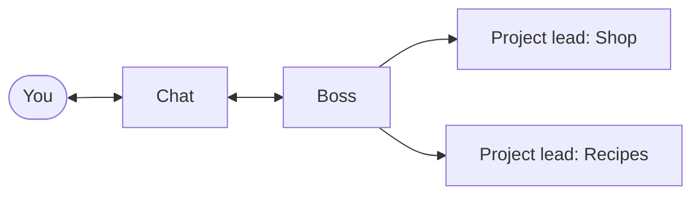
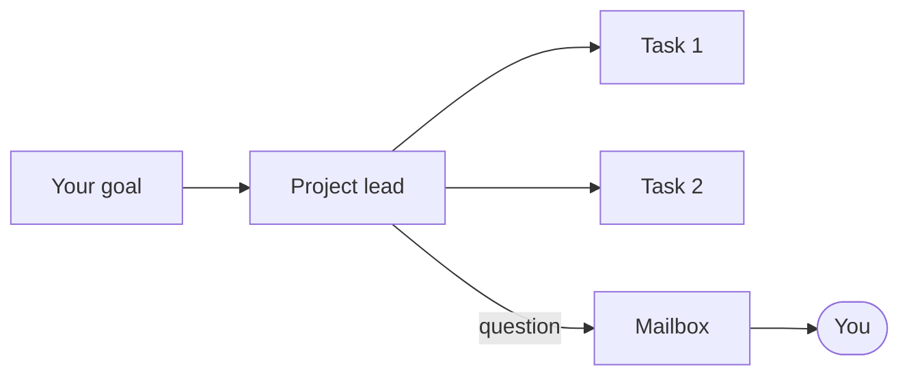
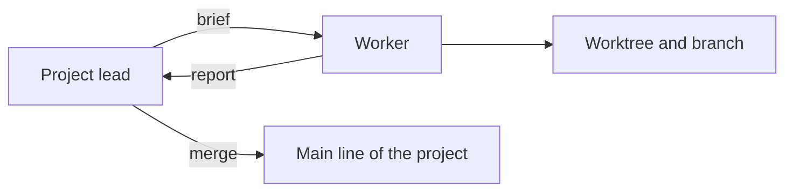
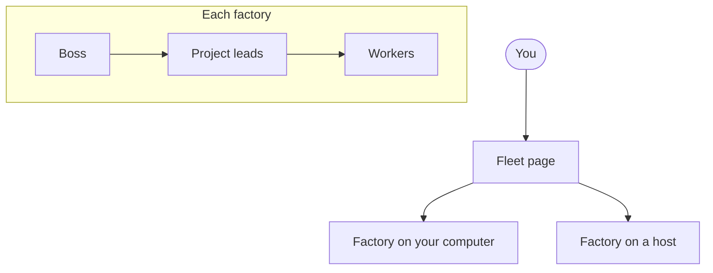
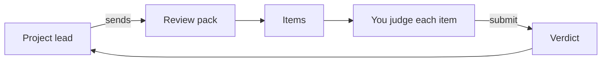
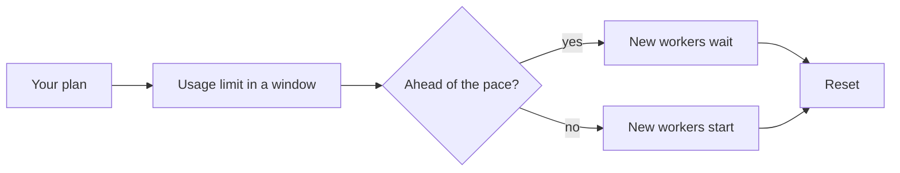
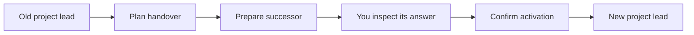
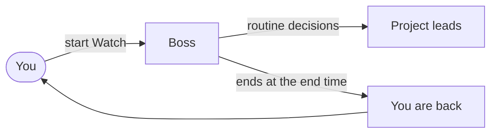

# Concepts

This page explains the parts of Herdr Boss. Each part has a short text and a diagram. Each diagram has a one-sentence description under it. Words in *italics* are in the [glossary](glossary.md).

## The Boss

The *Boss* is the one agent that watches all projects. It talks to you in the *Chat*. It also tells the project leads about changes that affect them.

You talk to the Boss in the Chat, and the Boss supervises each project lead.

To see what the Boss and the other agents do, read [I want to see what is happening](guide/see.md).

## Project leads

A *project* is one product that you build with agents. Each project has one *project lead*. The project lead plans the work, gives *tasks* to workers, and asks you a question when it cannot decide.

The project lead turns your goal into tasks and sends its questions to the Mailbox.

To create a project and its project lead, read [I want to add a project](guide/project.md).

## Workers

A *worker* is an agent that does one task for a project lead. Each worker makes its changes in its own *worktree* on its own *branch*. The project lead reviews the result and *merges* it.

The project lead sends a brief to a worker, the worker reports back, and the project lead merges the result.

To see each worker and what it does now, read [I want to see what is happening](guide/see.md#see-what-each-agent-does).

## Factories

A *factory* is one complete Herdr Boss setup on one computer or container. The factory on your own computer is the first one. A *host* is a computer that runs factories. The *Fleet* page lists all of your factories.

Each factory has its own Boss, project leads, and workers, and the Fleet page shows all factories.

To add a factory, read [I want to add a factory](guide/factory.md).

## Review packs

A *review pack* is a set of *items* with evidence. A project lead sends a pack when it has finished a part of the work. You accept, reject, or comment on each item. A *live check* opens the real result so that you can try it.

The project lead sends a pack, you judge each item and submit a verdict, and the project lead receives the result.

To judge a pack, read [I want to review a pack](guide/review.md).

## Usage limits and pacing

A *usage limit* is the part of your subscription that you can use in a *limit window*. When the window ends, a *reset* gives you full usage again. A *paced* *provider* spreads its use evenly over the window. Herdr Boss holds back new work when you are ahead of the pace.

Herdr Boss starts new workers while you are on pace and holds them when you are ahead of the pace.

To read the limits and to choose how to use them, read [I want to limit the cost](guide/cost.md).

## Handovers

A *handover* gives the work of a project lead to a fresh agent. The old agent can come near its usage limit or fill its context. You can plan a handover on the project page, or Herdr Boss can recommend one.

You plan a handover, inspect the answer of the successor, and confirm, and then the new project lead takes over.

To plan a handover, read [I want to limit the cost](guide/cost.md#let-a-fresh-agent-take-over).

## Watch

A *Watch* tells the Boss that you are away. The Boss makes the routine decisions until the Watch ends. You choose an end time, or you stop the Watch yourself.

The Boss makes the routine decisions for you from the start of the Watch until its end time.

To start a Watch, read [I want to see what is happening](guide/see.md#let-the-boss-act-while-you-are-away).

## Next

- [Start here](start-here.md) takes you through your first hour.
- [User guide](user-guide.md) has one chapter for each job.
- [Reference](reference/index.md) has the technical details.
