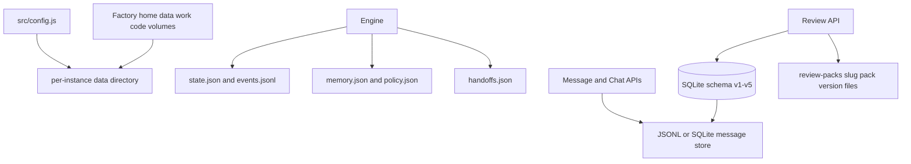
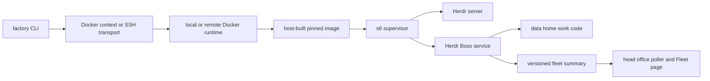
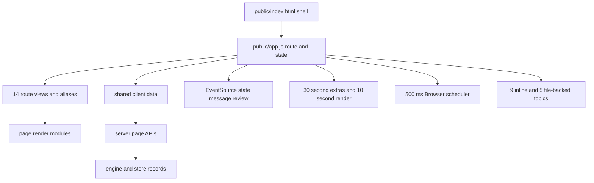

# ARCH1: Herdr Boss architecture, GUI, and factory study

Date: 2026-10-07
Branch: `arch1`
Scope: read-only architecture study. This document records the current checkout. It does not approve a product change.

## 1. Map

Herdr Boss has four main runtime layers:

1. The CLI starts service commands and runs factory, kit, worker, and project operations.
2. The service coordinates collection, policy, project state, actions, and events.
3. The HTTP server exposes page APIs and a state event stream.
4. The browser renders the dashboard and sends Owner actions to the APIs.

Factory code adds a fifth layer. It runs the same project inside either a native service or a supervised container. Fleet contracts carry selected state between factories.

```mermaid
flowchart LR
  CLI[src/cli.js] --> Engine[src/engine.js]
  Engine --> Collect[src/collect.js and readers]
  Engine --> Policy[src/control.js and rules.js]
  Engine --> Store[JSON files and SQLite]
  Engine --> Server[src/server.js]
  Server --> APIs[HTTP APIs]
  Server --> SSE[/api/events]
  APIs --> Browser[public/app.js]
  SSE --> Browser
  Browser --> Views[public feature modules]
```

**CLI and service.** `src/cli.js` owns command dispatch. Its `main()` body is about 820 lines by a brace-depth scan (`src/cli.js:517-1336`). It installs launchd on macOS and a user systemd unit on Linux (`src/install.js:10-22,155-189`). `src/server.js` creates the engine and serves the dashboard (`src/server.js:223-270`). Its `serve()` body spans about 1,152 lines (`src/server.js:223-1374`).

**Engine.** `src/engine.js` imports collectors, rules, project and worker modules, quota and spend readers, handoff logic, browser management, review packs, messages, fleet modules, and locks (`src/engine.js:7-50`). It keeps file paths for state, events, memory, bulletin, and policy near the top of the module (`src/engine.js:62-83`). The `tick()` coordinator spans about 667 lines (`src/engine.js:842-1507`). It collects concurrent readings, keeps prior readings when a source fails, evaluates state, and runs actions when action mode is on.

**Server and events.** One HTTP handler routes page APIs, settings writes, factory APIs, messages, reviews, project creation, browser actions, and status. `/api/state` returns a masked engine snapshot (`src/server.js:574-580`). `/api/chats` projects message-store rows into writable chat threads and keeps Mail unread counts separate (`src/server.js:585-601`). `/api/messages` handles Mailbox reads and writes (`src/server.js:1124-1154`). The server sends engine, message, and review events to the browser (`src/server.js:1240-1248`; browser listeners are at `public/app.js:9330-9345`).

**Data.** The default data directory is `~/.herdr-boss`, with test and deployment overrides in `src/config.js:6-15`. SQLite has five ordered migrations, a schema-version table, a transaction per migration, a quick check, and WAL mode (`src/sqlite-store.js:129-137,140-271,273-299,306-326`). That database stores messages and review records. Review pack files remain in a versioned directory beside the database (`src/review-store.js:1-4`). Messages can use JSONL or SQLite (`src/message-store.js:1-18,291-301`). Policy and handoff state remain JSON files. Policy merges defaults and has targeted migrations, but no top-level schema version (`src/control.js:11-24,119-135,388-410`). Handoffs use an atomic temporary-file rename and have no explicit record schema version (`src/handoff.js:18,147-150`).



**Kit and control.** The kit checker hashes selected templates, skill references, models, and watch files into a 12-character content revision (`src/kit/agents-check.js:51-73`). Worker start, model selection, lock handling, handoff, policy, and engine coordination share module dependencies. The source has four static import cycles in the scan described in section 3.

**Factory host and factory service.** Host transport runs Docker through a selected context or SSH, with injectable process spawning (`src/factory-transport.js:14-25,67-90`; `src/factory-core.js:49-58`). The host builds its own pinned image (`docs/adr/0015-image-built-on-each-host.md:9-17`). The container uses s6 to supervise SSH, Herdr, and Herdr Boss (`docs/factory-image.md:30-35`). Its data, home, work, and code live in separate volumes (`docs/factory-image.md:41-52`).



## 2. Seams

| Seam | Current boundary | Strength | Limit |
|---|---|---|---|
| Collector and engine | `collect.js` functions are injected or wrapped by the engine | Readers can fail independently; the engine can keep prior state | The tick coordinates many unrelated responsibilities and owns much of the timing policy |
| HTTP and page APIs | `server.js` routes to review, project, host guide, fleet, browser, and state helpers | Some high-risk areas already have named API factories | The `serve()` body also owns many routes and cross-cutting concerns |
| Stores | `openMessageStore`, SQLite store, review store, data-file safety | Message JSONL/SQLite choice and migration guards are explicit | Policy, handoffs, state, and some other JSON records do not share one visible version discipline |
| Host transport | `transportFactory` injection and normalized errors | Tests can use fake transport; private transport details are not returned | Native service management and container supervision remain separate implementations |
| Fleet contracts | JSON schemas and explicit semantic versions | Head office can select supported fields and report version drift | A newer sender can still include fields that an older reader does not use; update order remains operationally important |
| Browser | Feature renderers receive data from the main app | Some large views have isolated render modules | Routing, global state, polling, event handling, form preservation, and rendering still meet in `public/app.js` |
| Kit revision | Content hash over distributed kit files | Generated file drift is measurable without a release number | The hash is not a semantic version and does not explain which capability changed by itself |

The contracts with the clearest version rules are:

- Fleet registry: schema 1, contract `1.0.0` (`src/factory-store.js:44-45,77-84`).
- Head-office role and guidance: schema 1, contract `1.0.0` (`src/fleet-role.js:155-182`; `src/fleet-guidance.js:13-20`).
- Fleet summary: semantic contract `1.1.0`; the receiver selects fields, validates the selected record, checks the dashboard origin, and reports drift (`src/fleet-contract.js:17-36`).
- SQLite: migration versions 1 through 5 (`src/sqlite-store.js:140-271`).
- Review pack: `herdr-boss.review-pack/1`, plus a separate integer version for each stored pack revision (`src/review-pack.js:24`; `src/sqlite-store.js:162-180`).
- Kit: a content hash, not SemVer (`src/kit/agents-check.js:51-73`).
- Policy and handoff JSON: defaults and targeted migration exist, but no top-level schema version appears in these readers (`src/control.js:119-135,388-410`; `src/handoff.js:18,147-150`).

## 3. Hot spots and measurements

These measurements use the current checkout. The file scan includes first-party `.js` files under `src/**` and `public/**`, and excludes `public/vendor/**`.

| Measure | Result | Meaning |
|---|---:|---|
| First-party JavaScript | 197 files; 66,983 lines; 4,005,674 bytes | Includes 156 files under `src/` and 41 under `public/` |
| Largest browser file | `public/app.js`: 9,573 lines; 737,107 bytes | Shell, route selection, API refresh, events, forms, settings, and many view functions share one module |
| Largest service files | `src/engine.js`: 3,366 lines; `src/server.js`: 1,374; `src/cli.js`: 1,359 | The largest files also own high fan-in coordination |
| 30-day file touches | `docs/cli.md` 353; `docs/user-guide.md` 286; `public/app.js` 279; `docs/orchestration/memory.md` 202; `src/engine.js` 163 | Count of path mentions in `git log --since=30.days --name-only`, not line changes |
| Test inventory | 287 `*.test.js` files; about 5,173 textual `test(`/`it(` matches | A source-text count, not the number of tests run |
| Test risk scan | 130 test files mention clocks or timers; 18 mock clocks; 161 mention temp-data patterns; 54 mention live-data helpers or names | File-level textual matches, not proof of an unsafe test |
| GUI source scan | 46 `fetch(` occurrences, 1 `EventSource`, 7 `setInterval`, 16 `setTimeout` in top-level first-party public JavaScript | This count excludes vendor code and does not count timers created indirectly |
| HTML escaping | 7 public modules define an escaper | `allocation-draft.js`, `analytics.js`, `app.js`, `fleet.js`, `markdown.js`, `project-wizard.js`, `setting-help.js` |

The current static function scan found at least 18 bodies longer than 150 lines. The largest spans are `server.js:serve()` at about 1,152 lines, `cli.js:main()` at about 820, and `engine.js:tick()` at about 667. Other long spans include `public/review-sync.js:createReviewSync()` at about 473 lines, `src/kit/cli.js:commandKit()` at about 456, and `src/project-transfer.js:createProjectTransfer()` at about 328. The scanner recognizes common function, method, and block-arrow forms. It can miss some multiline signatures. The count of 18 is a lower bound.

The import graph scan found 605 local static import edges and these four cycles:

1. `src/kit/locks.js:11` → `src/kit/workers.js:13` → `src/leases.js:10` → `src/kit/locks.js`.
2. `src/kit/workers.js:13` ↔ `src/leases.js:13`.
3. `src/kit/locks.js:11` → `src/kit/workers.js:22` → `src/kit/opencode-start.js:5` → `src/kit/locks.js`.
4. `src/goal-set.js:4` → `src/project-new-api.js:9` → `src/project-new.js:17` → `src/project-new-workspace.js:9` → `src/handoff.js:14` → `src/goal-set.js`.

The cycle scan reads static relative imports in first-party JavaScript. It does not find dynamic imports or prove a runtime bug. The `locks`/`workers`/`leases` cycle couples lifecycle rules. The goal/project/handoff cycle is a second boundary to simplify.

**Test timing sample.** Each command used `npm test -- <one file>`. `scripts/test.js` launches Node with `--test-concurrency=2`, a temporary `HOME`, temporary Boss data, and a live-data write guard (`scripts/test.js:8-35,62-65`). The test runner also reported that the service changed its own live `state.json` and `events.jsonl` during these runs. Those snapshots are evidence only, not test results (`scripts/test.js:14-20,75-82`).

| Command | Result | Wall time |
|---|---|---:|
| `/usr/bin/time -p npm test -- test/quota-timeout.test.js` | 4 pass, 0 fail; test duration 5,314.6 ms | 6.24 s |
| `/usr/bin/time -p npm test -- test/kit-worker-start-collect.test.js` | 82 pass, 16 fail, 1 cancelled; 99 total; test duration about 100,014 ms | 100.98 s |
| `/usr/bin/time -p npm test -- test/server.test.js` | 57 pass, 0 fail; test duration 15,721.2 ms; three watcher `EMFILE` warnings | 16.83 s |
| `/usr/bin/time -p npm test -- test/factory-update.test.js` | 53 pass, 0 fail; test duration 17,870.9 ms | 18.63 s |

The 16 kit-test failures say the process start identity for the OpenCode start-lock owner cannot be read. The project memory records the same 16 failures on a worker and clean main, with unavailable process identity in the sandbox (`docs/orchestration/memory.md:602-604`). I did not change code or rerun that test. The server test passed, but its three `EMFILE` watcher warnings show a machine-limit risk.

The Owner brief gives a 25–30 minute full-suite baseline. K33 records a 15–25 minute long-lane hold from a Boss retro (`docs/plans/k33-suite-lanes.md:5-10`). These are different reported ranges. K33 timed 61 of 286 test files alone. Their total was 578.6 seconds, and its ten slowest files used 383.6 seconds (`docs/plans/k33-suite-lanes.md:17-21,24-37`). It did not derive the full suite time from this sample (`docs/plans/k33-suite-lanes.md:80`).

K33 counted 50 test files that run `git init` or `git worktree add`. It found 20 fixture-helper callers with 174 repository-creation calls (`docs/plans/k33-suite-lanes.md:48-60`). Another 125 files spawn child processes, with 141 CLI spawn call sites (`docs/plans/k33-suite-lanes.md:48-60`). The slowest test file builds 46 fixtures. Other slow files spawn the CLI or build large engine fixtures (`docs/plans/k33-suite-lanes.md:24-37`). `scripts/test.js` runs two files at a time (`scripts/test.js:62-65`). Repeated repository setup, child-process startup, large fixtures, file concurrency, and shared machine load explain much of the wait. K33 also states that 226 files were untimed. Its sample does not give a complete per-file model (`docs/plans/k33-suite-lanes.md:17-21`).

The flaky-test history has four recorded repairs. FL1 read only the newest 100 shared messages. FL2 removed a temporary home while a leftover tool-check process still wrote there. FL3 had a lock release throw `ELOCKBUSY` in `finally`; it now retries for up to 60 seconds. The preview CLI still left a tool-check process behind at that checkpoint (`docs/orchestration/memory.md:336`). FL4 repaired a timing-sensitive Escape test at `test/agent-prompt.test.js:181` (`docs/orchestration/memory.md:514-516`). A later suite still reported load-sensitive timeout failures at 33.6 and 25.5 seconds, plus one cancelled file (`docs/orchestration/memory.md:526`). Keep these failures and the current sandbox process-identity failure distinct.

## 4. Contracts and versions

The system already has useful contract mechanisms. Fleet summaries select allowed fields before they cross the factory boundary. The receiver validates a schema, semantic version, destination dashboard origin, and timestamp. Fleet guidance and role records use an epoch to reject stale ownership. The factory registry stores a connection reference instead of an SSH credential. These boundaries are good examples to reuse.

Versioning is uneven between data classes. SQLite has an explicit migration ledger. Review packs have a named schema and pack versions. Fleet records have explicit versions. Policy JSON depends on default merge and targeted migration. Handoff JSON depends on current code accepting its record shape. The next change should not add a blanket version field to every file. First list every persisted record, its reader, writer, migration, and rollback behavior. Then add a version only where an incompatible evolution needs it.

The service's deployment contract matters for data changes. Factory updates back up before each update. After restart they require `/api/state` to return 200 and one clean tick, or they roll back. A rollback after a migration restores the backup and can lose new data (`docs/specs/factories.md:233-240`). A new schema migration must keep this rollback rule visible and must prove the restore/import route.

## 5. Operational risks

1. **One coordinator owns many side effects.** `tick()` reads process, machine, Herdr, quota, project, worker, browser, message, and policy state. It can also run actions. Keep provider failures independent and retain each last good reading (`src/engine.js:842-1507`).
2. **A local check does not prove a live service.** A file scan or unit test cannot prove a service restart. It cannot confirm factory health, login readiness, or a live reader value.
3. **A process exit has different restart owners.** The Mac installer sets launchd `KeepAlive`. Native Linux writes a user systemd unit with `Restart=always`. s6 restarts factory services (`src/install.js:33-45,94-105`; `docs/factory-image.md:30-35`). These supervisors have separate setup paths. A repeated startup failure may recur after each restart.
4. **SQLite corruption blocks store startup.** The store runs `PRAGMA quick_check` when it opens. A failed check throws an error that directs the operator to restore a verified backup or import preserved JSON (`src/sqlite-store.js:129-137,320-330`; `docs/adr/0001-sqlite-state.md:47`). It does not repair the database in place. The service can fail again after its supervisor restarts it until the store is restored.
5. **Mac backup and restore need a clear operator path.** The SQLite store exposes `VACUUM INTO` backup and refuses to overwrite an existing destination (`src/sqlite-store.js:338-345`). The ADR requires verified restore or JSON re-import (`docs/adr/0001-sqlite-state.md:47`). This study found no single Mac command for a full service-data backup and restore. Treat OS backups as external until the operator runbook names and tests that path.
6. **Factory backup has a separate contract.** `factory backup` creates a private `.hfb` archive for the data and work volumes. `--include-home` adds login files. Restore needs the matching image and runs service checks (`src/factory-recovery.js:114-159,205-246`; `docs/cli.md:2033-2073`). A post-migration rollback can discard writes after the backup (`docs/cli.md:2021-2029`).
7. **Secret protection has a platform adapter.** FS1 seals inactive values and exposes metadata to the server. The server sends no secret value to the browser, an API, a log, or a Fleet summary (`docs/plans/fs1-secrets-design.md:86-107`). macOS uses Keychain. Linux uses a 0600 master-key file outside factory backup volumes (`src/secret-master-key.js:1-20`). Active tool login files remain readable by the same OS user, so agent rules and hooks remain part of the boundary (`docs/plans/fs1-secrets-design.md:80-83`).
8. **The repository is public.** Keep private runtime records in the data directory and credentials in the configured private store. Do not add client names, tenant addresses, app IDs, business records, tokens, keys, or login contents to this repository. The Docs service serves the README and `docs/` files under its access rule (`docs/help/docs.md:35-39`).
9. **Factory update tiers have separate recovery steps.** Service update changes code and restarts the service while panes remain available. Image update replaces the container and uses separate Boss and Owner checks (`docs/reference/factories.md:29-37`; `docs/cli.md:2021-2029`). Keep the two commands and rollback outcomes distinct.
10. **The head office has one active holder.** Factory zero is the current Mac head office. Fleet polling stops when it sleeps, while remote factories continue to run (`docs/adr/0009-head-office-starts-on-factory-zero.md:9-17`). Promotion stays manual until two always-on candidates and recovery rules exist (`docs/adr/0022-manual-succession-first.md:7-16`).

Image drift remains an operating cost. Each host builds an image for its CPU. Matching pins can still install different system package versions. Status records the build date and pins hash (`docs/adr/0015-image-built-on-each-host.md:9-17`).

## 6. Agent workflow risks

The workflow uses project instructions, kit rules, worker briefs, CLI checks, run records, and collection checks. Each layer has a different authority. A local pass can still fail collection when paths or report fields disagree. Keep one acceptance command and exact allowed paths in each brief.

The CLI parses `--allow-boss-restart` for image updates. `factory-update.js` checks the live Boss pane and accepts the flag at its command boundary (`src/factory-update.js:123-125,235,574,673-701`). The classifier denied an image update with that flag while a factory Boss pane was live (`docs/orchestration/memory.md:586`). The Boss decision says to never run that update while a factory Boss pane is live and to use no flag without the Owner present (`docs/orchestration/memory.md:597`). The CLI syntax describes a possible override. The classifier and Boss rule apply the current authority gate. The flag does not grant approval.

The kit, CLI, and classifier also differ on worker-scope exceptions. A worker collection was denied after a message approved out-of-scope edits because the run record had no scope override (`docs/orchestration/memory.md:336`). The brief and classifier both enforce the recorded file scope. The next improvement should make the refusal and its required approval path explicit in the CLI output and kit. It must preserve the scope check.

Idle notices have had false-positive repairs. K4 made the ready-work picker skip epic cards and tasks waiting on the Owner. K17 held the notice while open review packs or status reviews remained (`docs/orchestration/memory.md:366,370`). The current `idleOpenWork` checks open packs, review tasks, a `spec` task in `doing` with no live worker, and stale phase or summary text. It treats held groups and epic cards as non-blocking. An unknown pack read holds the notice (`src/rules.js:91-110`; `src/engine.js:1176-1179`). The kit repeats this criterion (`kit/skills/herdr-orchestrator/reference/ledger-and-evidence.md:35`). Keep the code, kit text, and notice tests aligned.

Large orchestration functions make independent changes hard to review. `engine.tick()` combines observations and actions. `server.serve()` combines route parsing, validation, and response handling. `cli.main()` combines command families (`src/engine.js:842-1507`; `src/server.js:223-1374`; `src/cli.js:517-1336`).

The test history includes FL1 through FL4 and later load-sensitive timeouts. Section 3 records the incidents and keeps the sandbox process-identity failures separate. Preserve each original failure and its environment. Do not weaken an assertion or timeout to make a repeat pass.

## 7. GUI inventory, link paths, and shared layer

### Inventory

`public/index.html` owns the brand, top icons, primary navigation, Help, live status, and `#app` (`public/index.html:21-37`). Its menu names nine routes. `public/app.js` routes 14 page views plus legacy aliases (`public/app.js:7818-7846`). Every route loads `/api/state` and the shared event stream. The server sends state, message, and review changes on that stream (`public/app.js:2323,9330-9345`; `src/server.js:1240-1248`).

The table inventories every route and its main render modules. “Shared” means the `/api/state` snapshot, `/api/events`, header, and global refresh work. The 30-second refresh reads 11 APIs for models, usage, browser sessions, handoffs, denials, Mailbox counts, chats, prices, spend, analytics, and machine hours. Analytics may also read the quota plan. A third 30-second timer refreshes the Roamgate card (`app.js:9392`). The shell runs a 10-second render timer and a 500 ms Browser scheduler while a preview is active (`public/app.js:9355-9413`).

| Route and module | API and local state | Refresh and counts | Navigation, lists, cards, chips, CSS |
|---|---|---|---|
| Overview `/` · `app.js` | Shared state. Handoff actions read `/api/handoffs` and `/api/handoffs/output`; actions can post `/api/tick`. Most view state comes from the engine snapshot. | Shared events and refresh. It shows project, worker, review, lock, and notice totals from state. | Global menu. Project summaries, activity rows, and status cards use local markup and badges. `style.css`. |
| Fleet `/fleet` · `app.js`, `fleet.js` | `/api/fleet`, `/api/fleet/settings`, `/api/fleet/shares`, `/api/fleet/nudge`, and shared quota data. State includes Fleet data, settings, shares, drafts, and feedback (`public/app.js:45-100`). | Fleet and global data refresh on the 30-second loop. It counts factories, alerts, readings, projects, and pending items. | Global menu. Factory cards, project rows, alerts, and share controls use Fleet status and pill markup (`public/fleet.js:302-344,405-547`). `style.css` and `fleet.css`. |
| Board `/board` · `app.js`, `board.js` | Shared state. `public/board.js` derives lanes, tasks, dependencies, and visible done rows. Filters and open cards stay in page state. | Shared events and render timer. Lane and task totals come from current project status. | Global menu. Lanes hold task cards and state chips. There is no separate page menu. `style.css`. |
| Reviews `/reviews/...` · `app.js`, `review.js`, `review-viewer.js`, `review-sync.js` | `/api/reviews` family, pack reads, answers, notes, text, and preview calls. `reviews` holds lists, packs, item state, drafts, filters, and sync state (`public/app.js:6907-6955`). | Review events and age-based reloads; a queued list reload can run after 400 ms. Counts include open, accepted, denied, changed, and live-check items (`public/app.js:6978-7017`; `src/review-store.js:545-557`). | Global menu. A pack sidebar holds item rows. The viewer holds evidence, pins, and answers. Item badges and status chips use review markup (`public/review.js:256-271`; `public/review-viewer.js:515-523`). `style.css`. |
| Agents `/agents` · `app.js`, `agent-chat.js`, `worker-rows.js` | Shared state, agent-message reads, `/api/worker-brief`, and Messages dialog APIs. `workerUi` and `agentChat` hold filters, open rows, briefs, pair lists, and conversation state (`public/app.js:1847,4698-4710`). | Shared events and global refresh. Counts group workers by state and agent-message pairs. | Global menu. The page renders a workspace graph and worker rows. Status badges are local to the app and agent-chat renderers. `style.css`. |
| Projects `/projects`, `/projects/:slug` · `app.js`, `project-live-view.js`, `project-wizard-ui.js` | Shared state, avatar uploads, goal status, and project actions. `projectViews` holds view state; worker briefs have a separate cache (`public/app.js:1142-1157,1853,5928,8628`). | Shared events and refresh. Project and task counts derive from current project status. | Global menu. Project lists, task cards, and details use cards, tables, phase badges, and task chips. `style.css`. |
| Browsers `/browsers` · `app.js` | Shared state and `/api/browser-sessions` navigation, tabs, screenshot, and request endpoints (`public/app.js:1550-1616,9291`). Preview URLs, tabs, modes, and refresh intervals stay in app state. | Shared events. The scheduler checks every 500 ms while live previews are active. Each preview follows its selected interval. Counts show sessions and tabs. | Global menu. Browser rows and preview cards show health and control state. `style.css`. |
| Allocation `/allocation` · `app.js`, `allocation-draft.js` | Shared policy state plus `/api/pools` and `/api/policy` reads and writes (`public/app.js:596-608,2404,9273`). The policy draft stays in the app. | Shared events and global refresh. The page displays pool shares and total percentages. | Global menu. Pool rows, sliders, and allocation bars carry their own labels and status text. `style.css`. |
| Analytics `/analytics` · `app.js`, `analytics.js` | The shared refresh fills models, usage, browser sessions, handoffs, denials, Mailbox counts, chats, prices, spend, analytics, and machine hours (`public/app.js:9363-9381`). `analyticsData`, `spendData`, `machineHours`, and local filters hold page state. | Refresh every 30 seconds plus shared events and render timer. Tiles and charts count runs, tokens, denials, notices, locks, and machine samples. | Global menu. Chart cards, tables, and range controls use page markup. Few status chips appear. `style.css`. |
| Mailbox `/mailbox` · `app.js`, `mail-rows.js`, `mail-bar.js`, `attachment-ui.js` | `/api/mailbox` by folder or conversation, `/api/messages`, and attachment APIs (`public/app.js:3320-3353,3416,3718,3782`). `mailbox` holds folder, items, drafts, open thread, and dialog state. | Message events refresh counts and selected lists. The separate Messages dialog polls its open thread every 10 seconds. Header and folder counts use different projections. | Global menu plus a second drawer on Mailbox. The list uses message rows and action cards with delivery and action chips. `style.css`; phone shell in `app-view.js:1-8`. |
| Chat `/chat` · `app.js`, `agent-chat.js`, `chat-jump.js`, `app-view.js` | `/api/chats`, `/api/chats/:thread`, and per-thread read calls; messages use `/api/messages` (`public/app.js:4393-4459`). `chat` holds thread, history, draft, pending sends, and scroll state. | Message events update Chat. Global refresh reloads the chat list. The separate Messages dialog polls every 10 seconds. | Global menu plus the second drawer. Thread rows and message bubbles use Chat markup and delivery chips. `style.css`; phone shell in `app-view.js:1-8`. |
| Settings `/settings` · `app.js`, `setting-help.js` | `/api/settings`, `/api/policy`, `/api/settings/prices`, and `/api/watch/*` (`public/app.js:539,596-608,981,8488`). Drafts and form feedback stay in app state. | Shared events and global refresh. `syncWatchForm` runs every 30 seconds to update the Watch form (`public/app.js:8993`). The page has no aggregate count. | Global menu. Settings use grouped forms and status lines. Help text comes from `setting-help.js`; `style.css`. |
| Docs `/docs/...` · `app.js`, `docs-view.js`, `markdown.js`, `explainer.js` | `/api/docs/tree`, `/api/docs/page`, and `/api/docs/help/:topic`; the `docs` object caches text, load time, and errors (`public/app.js:183,195-210,6849`). | Loads on route entry and reloads stale pages on revisit. It has no polling or page counts. | Global menu does not link Docs directly. The page uses a document list, Markdown, and the embedded Explainer. It has no status chips. `style.css`, `docs.css`, and `explainer.css`. |
| Add host `/fleet/add-host` · `app.js`, `host-guide.js`, `host-guide-view.js` | Host-guide API calls use the URL passed to `HostGuideClient`; step data and answers stay in the guide view (`public/host-guide.js:145-160`; `public/host-guide-view.js`). | The guide polls its current check every 10 seconds (`public/host-guide.js:217`). Its progress count tracks setup steps. | The page has a return path to Fleet and a step list. It uses forms, check rows, and result marks. `style.css` and `host-guide.css`. |

`explainer.js` is embedded in Docs rather than a fifteenth route. The static shell loads five style sheets for every page: `style.css`, `fleet.css`, `docs.css`, `host-guide.css`, and `explainer.css` (`public/index.html:14-18`). `style.css` is 263,019 bytes, about 257 KiB. The five files total 296,007 bytes. The base file has color and font variables, but no complete spacing or type scale (`public/style.css:1-35`). Page-specific rules remain distributed across these sheets.

The browser tree has 41 first-party JavaScript modules. They divide into app shell, messaging, reviews, analytics, settings help, Docs, setup wizard, Fleet, and feature renderers. `public/app.js` still owns routing, shared data, refresh, events, forms, and rendering.

`APP_VIEW_ROUTES` applies the phone-height shell to Mailbox, Reviews, and Chat (`public/app-view.js:1-8`). Help has nine inline topic bodies plus five file-backed topics: Add host, Board, Browsers, Docs, and Fleet (`public/app.js:6591-6850`). The Docs page lists those same five files under Page help (`docs/help/docs.md:27-33`). Settings help uses a separate data module and renderer (`public/setting-help.js:121-132,958-970`).



### Duplicated work and link paths

The source has seven HTML escapers in public modules. Their treatment of nulls, quotes, and URLs can drift. Keep HTML escaping separate from URL allow-lists and Markdown sanitizing (`public/allocation-draft.js`, `analytics.js`, `app.js`, `fleet.js`, `markdown.js`, `project-wizard.js`, and `setting-help.js`).

Time-label presentation crosses five modules: `app.js`, `agent-chat.js`, `board.js`, `fleet.js`, and `review-viewer.js`. The app has relative-age rules (`public/app.js:361-373`). Board and Fleet have their own relative-age rules (`public/board.js:293-320`; `public/fleet.js:16-20,332-337`). Agent-chat accepts formatter callbacks from its caller (`public/agent-chat.js:1-2,114-141`). The review viewer has its own presentation boundary (`public/review-viewer.js:1-8`). A shared time-format contract should specify absolute time, relative age, missing values, and stale status.

There are at least five page-specific chip or badge families: app project and task chips, agent-message badges, Board task states, Fleet status pills, and review item badges. They use separate markup and CSS classes (`public/app.js:5359,6015`; `public/agent-chat.js:133-141`; `public/board.js:39-48`; `public/fleet.js:271-310`; `public/review-viewer.js:515-523`).

Unread and count logic has four distinct layers. `mailboxCounts` creates top-bar values. `/api/chats` subtracts Mail unread rows per thread. The shell projects these values to three icons. Each page then counts its own folder, thread, pack, task, or factory rows (`src/messages.js:210-218`; `src/server.js:585-601`; `public/app.js:4066-4078`). The numbers have different definitions, so headers and page totals can disagree.

The same communication record appears through four render families: Chat bubbles, Mailbox rows and conversation cards, the Boss thread, and review-pack cards. A `reply` with a decide action can be both a Chat bubble and a Mailbox card. The store derives its channel after writing the record (`docs/plans/msg1-messaging.md:46,54-61`; `src/messages.js:129,148,297`). Agent-to-agent messages add a fifth presentation through `agent-chat.js:128-147`.

The review pack and its Mailbox item use separate records. `review_packs.mail_id` can be null and `setMailId` writes an optional reference. The pack page reads pack state; the Mailbox reads message state (`src/review-store.js:470-489,545-557,624-631`; `src/messages.js:296-319`). A pack can therefore have a card without a Mailbox item. There is no shared route contract that guarantees a pack-to-item link.

Fleet summaries carry each factory's project rows. The Projects page reads the local project register in the current factory. No shared factory-plus-project identity links a remote Fleet project row to a local register route (`src/fleet-summary.js:49-51,89-102`; `public/fleet.js:302-313`; `src/projects.js:158-164`). A matching slug can refer to distinct records on two factories.

The app has one primary menu and one extra drawer on Mailbox and Chat. That drawer has eight destinations. It omits Fleet, Settings, and Docs (`docs/plans/msg1-messaging.md:57-61`; `public/app.js:3586-3597`). This is the second navigation called out in MSG3.

Deep links exist for Chat threads, Mailbox conversations, review items, Board task queries, and Browsers-to-Allocation hashes (`public/app.js:3639-3655,4130-4131,7827-7835,9335-9339`; `public/review.js:94-105`). Missing links remain. The Messages dialog does not put its thread in the URL. A Mailbox item has no stable route to its review pack. A review pack route does not guarantee a link to its Mailbox item. A Fleet project row has no factory-scoped Project Register link. A Project Register row also has no factory-scoped link to its Fleet card. An Agents row opens a brief panel, but a report has no stable page route. These gaps are separate from a dead `href` scan.

Known route translations are deliberate: `/p/:slug` becomes `/projects/:slug`, `/organization` becomes `/agents?view=chart`, and `/logs` becomes Analytics or Overview guidance (`public/app.js:7818-7825`). The Board task link selects its task and then removes the query (`public/app.js:7827-7835`). The Browsers-to-Allocation link waits for state before revealing its hash (`public/app.js:9335-9339`). The static scan proved no 404. Add route tests before changing these contracts.

There is one current Fleet action-state gap from the prior FPT5 review. The server adds an `attach` value to remote rows (`src/server.js:541`). The Fleet card shows a fixed “Copy attach command” action and does not read `row.attach` (`public/fleet.js:369-381`). The prior F1 finding that hid unavailable factory names now appears fixed. `coverageLine()` renders those names in visible text and keeps the full reason in its details (`public/fleet.js:117-147`). The prior browser check remains unverified. The prior escaping-test finding was not rechecked against tests.

### Shared-layer proposal and migration

Build one framework-free app shell in small slices. Keep business totals in the service.

1. Extract one route registry and navigation component. Store each path, alias, menu label, Help source, phone-shell rule, and deep-link parser in one place.
2. Add one client data store. It owns API state, fetch errors, cached records, event subscriptions, and refresh ownership. Keep one Server-Sent Events connection. Pages declare the records they use. The store handles reconnect and stale data.
3. Extract shared list, card, chip, thread, Mailbox item, timeline, empty, and error components. Add one formatter and mask module. Keep URL policy and Markdown sanitizing at their security boundaries.
4. Add a CSS token sheet for color, spacing, type, borders, and focus. Migrate the current base and four page sheets in place. Keep page rules until each page passes review.
5. Start with the shell, data store, and two components: a list row and a status chip. Add focused tests for route matching, event updates, optional API failures, escaping, labels, and counts.
6. Move one existing page at a time. For every page, record browser evidence at 1280 by 800 and 393 by 852. Check routes, list and card states, keyboard use, Help, and deep links before moving the next page.
7. Move Mailbox, Chat, and Reviews after tests prove shared counts and thread links. Move Fleet and Projects after a factory-scoped project identity exists. Start a new page only after the Owner accepts this pack.

The first implementation can extract route matching without changing output. Tests should cover all 14 routes, three aliases, project-task selection, review item hashes, Allocation hashes, and phone-shell membership. Each page must survive a failed optional endpoint without blocking other views. Browser captures become part of each page's acceptance evidence.

## 8. Factories, a second host, and a second head office

### Current boundary

Factory and head-office instances use the same CLI, engine, stores, and dashboard. The image comes from this repository and a pinned tool list. It mounts separate data, home, work, and code volumes (`docs/factory-image.md:25-52`). Docker-context and SSH transports have injectable process execution (`src/factory-transport.js:14-25,67-90`; `src/factory-core.js:49-58`).

| Difference from the Mac path | Evidence | Classification |
|---|---|---|
| Service supervisor | The Mac installer writes a launchd agent. Native Linux uses a user systemd unit. The container uses s6 as PID 1 (`src/install.js:10-22,33-45,94-105,155-189`; `docs/factory-image.md:30-35`). | Copied lifecycle paths. Each supervisor has separate install and restart code. The service contract is shared. |
| Data and private paths | The default data path follows the OS home. The factory mounts data at `/home/factory/.herdr-boss`; factory bootstrap code names that path directly (`src/config.js:6-15`; `docs/factory-image.md:45-52`; `src/factory-boss.js:12-14`). | Clean `HERDR_BOSS_DIR` seam for normal service data. Factory bootstrap keeps path constants as a platform fork. |
| Runtime user | The Mac service runs as its logged-in Owner. The image runs as `factory`, UID 1000 (`src/install.js:159-187`; `docs/factory-image.md:33,52`). | Copied image contract. UID and volume ownership are fixed during image setup. |
| Browser executable | The Mac default is Google Chrome. The image uses `/usr/bin/chromium` and sets `chromePath` in factory config (`src/config.js:44-45`; `docs/factory-image.md:35`). | Clean executable-path setting. Browser packaging remains platform-specific. |
| Codex sandbox | The factory image includes bubblewrap. The host registry sets `codexSandbox` and selects tested user-namespace settings or excludes Codex (`docs/factory-image.md:32`; `docs/reference/factories.md:5-7`). | Clean host setting with a factory-only sandbox runtime. Codex on macOS uses the sandbox provided by its app. |
| CodexBar installation | The Mac collector searches Homebrew paths. The factory downloads an architecture-specific pinned tarball and checks its SHA-256 (`src/collect.js:11`; `docs/plans/fq4-codexbar-factory.md:9-14`; `src/factory-codexbar.js:16-28,130-156`). | Copied installer paths. Both call the same `codexbar usage` reader. |
| Factory Boss bootstrap | `factory boss start` checks login and first-run state. It installs kit files, checks Herdr, creates or reuses the Boss workspace, sends a prompt, and checks readiness (`docs/reference/factories.md:23-25`; `src/factory-boss.js:391-405,492-549`). | Factory-specific bootstrap fork with its own startup state machine. It reuses worker and message modules. |
| FS1 account and secret model | The store format is shared. macOS uses Keychain for its master key. Linux uses a 0600 file outside copied factory volumes (`src/secret-master-key.js:1-20`; `docs/plans/fs1-secrets-design.md:86-107`). Active tool login files remain local to each OS user (`docs/factory-image.md:52`; `docs/plans/fs1-secrets-design.md:80-95`). | Clean key-provider seam and shared metadata format. Account credentials and active logins remain per host or factory. |
| Wizard and login flow | Factory configure tracks resumable setup steps. `factory login` signs into the labeled container and checks credentials. Add host has its own host test and reboot guide (`src/factory-wizard.js:1-89`; `docs/reference/factories.md:21-25`; `docs/help/add-host.md:25-52`). | Copied workflow. The Mac uses its local login and install steps; the factory uses a resumable container wizard. |
| Quota readers | `collectQuotas` tries CodexBar first. A factory can use a provider reader when CodexBar is missing or unusable (`src/collect.js:236-257,315-351`). The Mac and factory used CodexBar for the verified readings (`docs/plans/fq4-codexbar-factory.md:13-14`; `docs/orchestration/memory.md:588`). | Clean reader seam. The fallback readers and credential availability remain platform-specific. |
| Update and rollback | The service tier fast-forwards code and restarts the Boss service. The image tier replaces the container. Factory recovery makes a private backup and can restore the old code or image (`docs/reference/factories.md:29-37`; `docs/cli.md:2021-2029`). | Factory update state machine. The Mac release uses launchd and the integration release sequence. |
| Fleet summary and poller | A factory sends a versioned summary. The head office validates and selects fields before rendering Fleet (`src/fleet-contract.js:22-36`; `src/fleet-summary.js:1-20,89-102`). | Clean read contract. It sends summary records instead of sharing the live store. |
| Head-office role | Factory zero is the Mac head office. Role and guidance records use epochs. Promotion remains a manual command while there is one always-on candidate (`src/fleet-role.js:155-182`; `src/fleet-guidance.js:13-20`; `docs/adr/0009-head-office-starts-on-factory-zero.md:9-17`; `docs/adr/0022-manual-succession-first.md:7-16`). | Clean role record and epoch. Promotion and recovery remain manual workflows. |

A second factory host needs a supported Docker context or SSH transport, and a CPU-compatible image build. It also needs persistent volumes, loopback ports, tailnet reachability, Owner login, Codex sandbox selection, and a backup path. A Linux remote host appears in the transport and registry contracts. This list is an inference from configuration and guides. No second-host run was performed.

A second head office needs an always-on candidate, a copied factory registry and share configuration, a role promotion, and a larger epoch. Each reachable factory must receive the new role. The current plan keeps this manual until two always-on candidates, lease rules, and split-network recovery tests exist (`docs/adr/0022-manual-succession-first.md:7-16`; `docs/specs/factories.md:225-231`). No second head office was tested.

### Live findings and evidence limits

Project memory and the Owner-provided rework evidence record these live findings:

- On 2026-10-03, service-tier update failed at the Git merge on two factories. A generated kit file had a local change. Restoring it let the update pass. This records a failed update attempt and recovery (`docs/orchestration/memory.md:322`).
- The Owner says a Boss memory record dated 2026-10-05 records the first update attempt leaving a factory service down. That record is outside this worktree. I did not open private Boss memory. This is separate evidence from the recovered merge failure above.
- After another service update on 2026-10-03, a dialog check said “unknown” because pane capture was unavailable. The Boss panes were running and answered. Follow-up work fixed the false failure (`docs/orchestration/memory.md:319-321`).
- A 2026-10-04 project run stopped at a Claude trust dialog. It also found missing Git identity and a missing default project folder. Factory setup lacked OpenCode and Pi sign-ins, Claude auto-mode lines, Codex rules, an OpenCode worker profile, and a systemd user service. The CodexBar probe returned `spawn codexbar ENOENT` before the Linux reader was in use (`docs/orchestration/memory.md:337-341`).
- Fleet initially showed zero usage rows for a factory without a provisioned account record. FQ3 added per-factory rows (`docs/orchestration/memory.md:551-554`).
- A live CodexBar install extracted a symlink without its regular target. The repair extracts the binary file and refuses unsafe links (`docs/orchestration/memory.md:584-585`).
- The classifier denied an image update while a factory Boss pane was live. The Boss later recorded a rule to wait for that pane to stop or for Owner direction (`docs/orchestration/memory.md:586,597`).
- On 2026-10-07, both factories were reported healthy after the service update. CodexBar was installed. One factory returned the same Codex and Claude readings as the Mac. OpenCode Go stayed unknown because no API key existed. The other factory's Fleet lanes had not updated at the last read (`docs/orchestration/memory.md:588`).

These are historical live records. I did not connect to a factory, inspect private credentials, start a host, promote the head office, or test service recovery.

## 9. Ranked proposals

Value measures impact across daily use, recovery, and future work. Cost measures implementation and qualification effort. Low, medium, and high costs do not estimate money.

| Rank | Value | Cost | Problem and seam | First small step | Proving test | Effect on factories | Preserve |
|---:|---|---|---|---|---|---|---|
| 1 | High: every route | Medium: one module and route tests | Routing, navigation, global state, and rendering meet in `public/app.js`. Cut a shell and route registry seam. | Extract route matching, aliases, menu labels, Help sources, and phone-shell membership. | Test 14 routes, three aliases, task query, hashes, and one menu host. | Keeps URLs and navigation consistent on each dashboard. | Keep page output, labels, and current access rules. |
| 2 | High: all live data | High: migrate refresh ownership | SSE, global polls, page polls, and timers overlap. Add one client data store. | Name page API needs and let one store own fetch, cache, events, and refresh. | Test event updates, reconnect, optional API failure, and one refresh owner. | Reduces duplicate reads on every factory. | Keep server totals, fallback rules, and SSE delivery. |
| 3 | High: every view | High: many render modules and CSS | Lists, cards, chips, threads, items, empty states, and tokens use separate implementations. | Extract a list row and chip, then add the token sheet for color, spacing, type, borders, and focus. | Test labels, states, escaping, keyboard use, and light/dark tokens. | Gives native and container pages shared components. | Keep page behavior and Markdown or URL security boundaries. |
| 4 | Medium: service change review | Medium: one bounded route family | `serve()` owns many route families. Cut an API family seam. | Move one read-only route behind a named module. | Test response codes, body shape, and malformed input. | Makes small service updates easier to qualify on each host. | Keep every API contract stable during extraction. |
| 5 | High: runtime reliability | High: many tick side effects | `tick()` joins collection, policy, state, and actions. Name phases before moving them. | Extract one pure phase behind current behavior. | Inject clock and readers. Prove a failed source keeps its last good reading. | Makes provider failures easier to qualify on each host. | Keep cadence, aggregation, fallbacks, and action policy. |
| 6 | Medium: lifecycle changes | Medium: import and behavior tests | Four static cycles couple locks, workers, leases, and goal/project/handoff paths. | Break the `locks`/`workers`/`leases` cycle with one injected port. | Test imports, lock ownership, and lease behavior. | Keeps worker lifecycle logic common across factories. | Keep lock ownership and process identity checks. |
| 7 | High: data recovery | Medium: inventory and fixtures | Policy and handoff JSON have weaker visible version rules than SQLite and Fleet. | List each record's writer, reader, migration, backup, and restore owner. | Test old records and update rollback or import. | Reduces surprise during service and image updates. | Add versions only when an incompatible change needs them. |
| 8 | High: cross-page continuity | High: identity and routing | Fleet projects, the local register, review packs, Mailbox items, and worker reports lack complete cross-links. | Render attach state and define factory-scoped project, pack-to-item, item-to-pack, thread, and report links. | Test attached, missing, and unknown state plus message-to-thread, item-to-pack, project-to-Fleet-card, and worker-to-report destinations. | Lets the head office reach the correct factory record. | Keep credentials and remote host details out of links. |
| 9 | Medium: reproducible locks | Small: isolate one process reader | One test file ran about 101 seconds and reproduced 16 process-identity failures in this sandbox. | Put process-start identity reads behind an injected reader. | Test valid, missing, and stale identity; keep the real unavailable case. | Makes host, factory, and sandbox results easier to compare. | Keep the identity guard and current timeout. |
| 10 | High: second-host readiness | Medium: contract and platform checks | launchd, systemd, and s6 have separate lifecycle paths. | Write one install, ready, restart, backup, and rollback contract for each path. | Test fake supervisors and run one authorized update per supported platform. | Gives a second host an explicit qualification list. | Keep platform-specific checks and manual head-office promotion. |

The first three proposals form the shared GUI layer. New GUI pages wait for Owner acceptance of this pack. Existing service, CLI, and design work can continue under its current authority.

### Build ordering: wait or go

The Owner hold says to build no new GUI page until ARCH1 is accepted. It permits design notes and CLI work to continue (`docs/orchestration/memory.md:617`).

| Work | Go now | Wait for shared layer | Reason |
|---|---|---|---|
| MSG2 | Message model and store work. | Live browser refresh and shared unread UI. | Mailbox, Chat, and Reviews use separate projections and polling rules (`src/server.js:585-601,1124-1154`). |
| MSG3 | Design the unified page list. | Menu implementation. | The shell and Mailbox/Chat drawer currently own separate navigation (`docs/plans/msg1-messaging.md:57-61`). |
| PR1 | Design note and wireframe. | Project Register page. | The current Owner hold blocks a new GUI surface (`docs/orchestration/memory.md:617`). |
| UP1 | CLI, service behavior, and existing Settings work. | New Updates page. | Preserve service and image update checks. |
| RL1 | CLI and existing Settings slice. | New approval page. | Reuse the shared route and item components. RL1 slice B is recorded live (`docs/orchestration/memory.md:609-610`). |
| FS1 | Secret store, account model, and CLI. | New secret-management view. | Keep values out of shared browser state. FS1 follow-up depends on Owner-approved name listings (`docs/orchestration/memory.md:610`). |
| FQ4 | CodexBar install, reader checks, and factory verification. | New quota page or card. | Service-tier installation is released. OpenCode Go still depends on a factory API key (`docs/orchestration/memory.md:588-589`). |

The pack in `.worker/review-pack/` asks for a separate accept or deny choice for each proposal. It stays unpublished until the Owner decides.

## 10. Top ten findings

1. `public/app.js` is the main GUI integration point. It routes 14 pages and owns global state, refresh, events, forms, Help, and rendering.
2. The base `style.css` is 263,019 bytes. Five global stylesheets load on every route. Shared spacing and type tokens are incomplete.
3. The GUI has multiple counts, five chip or badge families, at least four message render families, and two menus on Mailbox and Chat.
4. The client uses EventSource, 11 regular API reads, a 10-second message-dialog poll, a 30-second Watch-form sync, and a 500 ms Browser scheduler.
5. Shared object routes are incomplete. A pack can lack a Mailbox reference. Fleet projects lack a factory-scoped register link. Worker reports lack a page route.
6. The server, CLI, and engine have coordinator functions of about 1,152, 820, and 667 lines.
7. Four static import cycles couple locks, worker start, leases, and goal/project/handoff paths.
8. SQLite, Fleet, review packs, policy, and handoff records use different migration and version rules. Mac full-instance backup needs an operator runbook.
9. Factory paths include clean seams and copied workflows. Service update failure and a separate 2026-10-05 service-down finding need distinct reporting.
10. The measured one-file test run reproduced 16 documented process-identity failures. K33 identifies repeated Git setup and CLI spawns as suite-time drivers. Full-suite ranges remain estimates or retro records.

## Evidence boundaries

- **Measured here:** source counts, churn counts, static function spans, import graph, and the four one-file test timings.
- **Unit tier:** the four test files listed in section 3. One failed for the recorded sandbox process-identity condition.
- **Not run:** full suite, dashboard browser, phone viewport, live service check, host/factory update, second-host check, or head-office promotion.
- **Owner tier:** not reached. The review pack is an unpublished draft and needs Owner acceptance.
